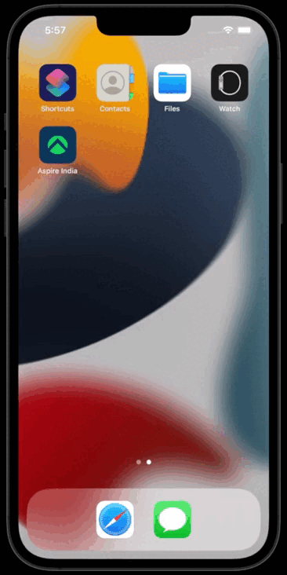

# 🏦 Finance management App for Aspire India Coding Challenge

This is a finance management application dummy project that can run on both Android and IOS devices. It features a mobile-first design, which includes features of debit cards like weekly limit, card activation or deactivation, requests for a new card, etc. It is using React Native for the front-end and mock API for the back-end.

## User stories

- story-1: - Project Setup & Folder Structure, Add theme, colors, matrices, dynamic fonts, svgs & universal styles.
- story-2: - Design Debit Card Screen & dynamic header according to XD, add service list & debit card.
- story-3: - Design Spending Limit Screen UI and on click of price show limit in price section and after save, set debit card limit.
- story-4: - Design Progress bar according to Spending Limit and calculate progress of spending & show dynamic progress in bar.
- story-5: - Add Android & IOS app icons. Configure eslint for lining(check code quality)
- story-6: - Create & Test IOS application. Add Safearea, Fonts & Icons for IOS app.
- story-7: - Add React-redux & Redux Saga. Configure Store & Integrate Mock API's for get dynamic debit card balance, card details, spending & weekly limit and post api for set spending limit.
- story-8: - Write Test Cases for the functios, atoms & components.

## Demo Video

<pre>         </pre>

- [Watch Android walkthough on Youtube](https://www.youtube.com/watch?v=N0_vfij4sYk)
- [Watch IOS walkthough on Youtube](https://youtu.be/KKALgBrvnOw)

**For convenience, demo application is uploaded on Google drive and accessible here :**

- [Download APK from Google Drive](https://drive.google.com/file/d/1ERpjzhhaxZXd6VeXxt-OvhEg_Sw7DoI5/view?usp=sharing)

## Tech stack

- React Native
- React Navigation
- React Redux
- Redux Saga

## Prerequisites

- [Node.js > 12](https://nodejs.org) and npm (Recommended: Use [nvm](https://github.com/nvm-sh/nvm))
- [Watchman](https://facebook.github.io/watchman)
- [Xcode > 12](https://developer.apple.com/xcode)
- [Cocoapods 1.10.1](https://cocoapods.org)
- [JDK > 11](https://www.oracle.com/java/technologies/javase-jdk11-downloads.html)
- [Android Studio and Android SDK](https://developer.android.com/studio)

## Setup environments

### Follow official docs from React native to setup development environment.

- [React-native](https://reactnative.dev/docs/environment-setup)

## Base dependencies

- [react-native](https://reactnative.dev/)
- [axios](https://github.com/axios/axios) for networking.
- [react-navigation/native](https://reactnavigation.org/docs/getting-started/)
  and [react-navigation/bottom-tabs](https://reactnavigation.org/docs/bottom-tab-navigator/) and [react-navigation/stack](https://reactnavigation.org/docs/stack-navigator/) navigation library.
- [react-redux](https://github.com/reduxjs/react-redux) for state management.
- [redux-saga](https://github.com/redux-saga/redux-saga) to dispatch asynchronous actions.
- [toggle-switch-react-native](https://github.com/aminebenkeroum/toggle-switch-react-native) toggle switch component.
- [react-native-vector-icons](https://github.com/oblador/react-native-vector-icons) vector icon library
- [react-native-svg](https://github.com/react-native-svg/react-native-svg) and [react-native-svg-transformer](https://github.com/kristerkari/react-native-svg-transformer) to render svg images as a component
- [react-native-screens](https://github.com/software-mansion/react-native-screens) and [react-native-safe-area-context](https://github.com/th3rdwave/react-native-safe-area-context) and [react-native-gesture-handler](https://github.com/software-mansion/react-native-gesture-handler) related to react-navigation

## Dev dependencies

- [jest](https://facebook.github.io/jest/) and [react-native-testing-library](https://callstack.github.io/react-native-testing-library/) for testing.
- [miragejs](https://miragejs.com/) for Mock API's

## Usage

- Android build & install : `npx react-native run-android`
- IOS biild & install : `npx react-native run-ios`
- Start server : `npm start`
- Run testcases : `npm test`
- Linting with eslint : `npm run lint`

## Folder structure

This Project follows a very simple project structure:

```
src/
├── assets
│   ├── fonts
│   └── images
│       └── svgs
├── components
│   ├── atoms
│   │   ├── button
│   │   ├── iconButton
│   │   ├── primaryButton
│   │   ├── progressBar
│   │   ├── serviceCard
│   │   ├── toggle
│   │   └── transparentButton
│   ├── molecules
│   │   ├── header
│   │   └── updateLimit
│   └── organisms
│       ├── cardDetail
│       ├── cardServices
│       ├── debitCard
│       └── spendingLimit
├── containers
│   └── container
├── global
├── navigation
│   └── bottomTab
├── redux
├── screens
├── store
├── theme
└── utils
```

## Generate Debug Android APK

### Android

- gradlew clean
  - `cd android`
  - `./gradlew clean`
- copy assets
  - `cd ..`
  - `react-native bundle --platform android --dev false --entry-file index.js --bundle-output android/app/src/main/assets/index.android.bundle --assets-dest android/app/src/main/res`
- debug build
  - `npx react-native run-android`

#### iOS

- debug build
  - `npx react-native run-ios`

## Generate production version

These are the steps to generate `.apk`, `.aab` and `.ipa` files

### Android

1. Generate an upload key
2. Setting up gradle variables
3. Go to the android folder
4. Execute `./gradlew assemble[Env][BuildType]`

Note: You have three options to execute the project
`assemble:` Generates an apk that you can share with others.
`install:` When you want to test a release build on a connected device.
`bundle:` When you are uploading the app to the Play Store.

For more info please go to https://reactnative.dev/docs/signed-apk-android

### iOS

1. Go to the Xcode
2. Select the schema
3. Select 'Any iOS device' as target
4. Product -> Archive

For more info please go to https://reactnative.dev/docs/publishing-to-app-store

## Styleguide

For coding styling, we decided to go with ESLint and [React Native community's styleguide](https://github.com/facebook/react-native/tree/master/packages/eslint-config-react-native-community#readme).

# How to use it

The idea of this section is to explain how the template composition is the best and easiest to use when you try to use well-formed, architectures, especially using redux flow.

The template follows a simple and convenient exporting pattern. The folder index exposes the resources, allowing to import all from the same path.

With that in mind, we are going to look at each folder to explain how to use it.

## Components

Components are the basic blocks of a react native application, but since we​​ aim to minimize development complexity, all the components are at the same nesting level.

Another important thing is the use of propTypes to check the kind of data that your components need to work properly. If the component receives some data from others, the type of these props must be defined, and in case you need it the default value of the property too.

### Static resources:

To keep an application scalable and organized, the global static resources that are used in the application have to be created in a specific file.

### We manage two main folders for that:

- Assets: Here you can store all the images and fonts that you need through the app. You have as an example : you can add two folders inside images, one is pngs and another one is svgs, to use with the different kind of images.

  - assets
    - images
    - fonts

- Theme: Here you can define all the styles that you use on different screens and universal styles which you have to use globally. To make easier the interaction of the application with device options for example you can create here colors file as light and dark color palette.

  - theme
    - colors
    - universal styles
    - dynamic fonts
    - matrices
    - svgs

## Redux

Once the components are defined, they are tied to the management of information through the application. For this, Redux is implemented with the store-reducer-action structure as usual, however, not only the data is handled through the actions but the success and error responses are also defined by the same form.

### Controllers folder and API connection handler

To keep the networking layer simple, the template uses a single Axios instance in the `Request.js`. It uses interceptors to define common side effects for the responses.

When you need communication with a service you have to create a function to manage the operation and grouping according to the kind of transaction inside a redux folder, please keep all of those inside the redux' folder.

While the data transfer between the API and the app is working you must use the success and error actions that help you to catch the result of the operation. With this method, you can track the interaction through the redux store. This is useful because you can create behaviors based on those states in a quick and simple way

### Redux folders

4 folders divide the redux work

- Store: Here you define the store shape and you can configure the persistReducer and middlewares.
- Actions: Remember to create the file and the corresponding test for each action classification. Here you define actions for success and error scenarios.
- Reducers: You have the error and success reducers by default. Create the other classifications and try to keep simple each file. Here you modify the store.
- Saga: Create one file for each action classification. Here you catch the response and errors.
- Services: In the services you can put endpoints with methods for the API call.

## Screens

In this folder, you have the main objects to apply the composition architecture. Just create a folder for each screen you have in your application, call all the components and static resources you need to render the scene and finally use the corresponding hooks to interact with redux and create behaviors depending on the store.
